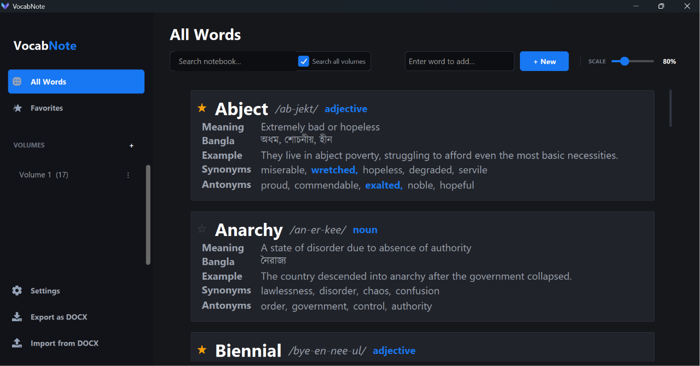

````md
<div align="center">



<br/><br/>

# 📚 VocabNote


<br/>

### Modern desktop vocabulary notebook with universal AI support

Store, enrich, organize, and export your vocabulary with a fast and polished desktop experience.

<br/>

[Features](#-features) • [AI Providers](#-ai-providers) • [Installation](#-installation) • [Quick Start](#-quick-start) • [Build](#-build-a-windows-executable) • [Roadmap](#-roadmap)

</div>

---

## What is VocabNote?

VocabNote is a desktop vocabulary notebook designed to make word learning simple, fast, and organized.

Instead of switching between browser tabs to search for meanings, pronunciations, examples, and synonyms, you can enter a word directly into VocabNote. The app uses your chosen AI provider to generate a structured vocabulary card, then stores it locally for instant offline access.

It is built for students, language learners, and anyone who wants a clean place to keep vocabulary notes.

---

## ✨ Features

### 🤖 Universal AI support

VocabNote works with OpenAI compatible APIs and supports multiple providers through a simple settings dashboard.

Supported providers include Google AI Studio, OpenRouter, Groq, Mistral AI, GitHub Models, Hugging Face, and local model setups such as Ollama and LM Studio.

### 📖 Rich vocabulary cards

Each word can include:

<table>
<tr>
<td><b>Meaning</b></td>
<td><b>Bangla meaning</b></td>
<td><b>English definition</b></td>
</tr>
<tr>
<td><b>IPA</b></td>
<td><b>Part of speech</b></td>
<td><b>Example sentence</b></td>
</tr>
<tr>
<td><b>Synonyms</b></td>
<td><b>Antonyms</b></td>
<td><b>Notes</b></td>
</tr>
</table>

### ⚡ Fast desktop performance

VocabNote uses a custom Canvas based rendering engine designed for responsive browsing and editing.

This keeps the notebook light and smooth even when the word list grows large.

### 🎨 Deep customization

The Settings dashboard gives you fine control over the notebook layout.

You can adjust spacing, typography, padding, and preview behavior, then see the changes live before saving.

### 🗂️ Smart organization

Keep your notebook clean with unlimited volumes, favorites, search, and interactive synonym and antonym tags.

### 📄 DOCX import and export

Move vocabulary in and out of the app with ease.

You can export a single volume or the entire notebook, and you can import DOCX files with duplicate handling options such as replace, skip, replace all, and skip all.

### 🧠 Offline first

All vocabulary, settings, layout preferences, favorites, and volumes are stored locally in SQLite.

The internet is only needed when fetching a new word from an AI provider.

### 🧩 Responsive by design

The app keeps the interface usable while work happens in the background.

It uses background threads for API calls, non blocking UI updates, and defensive parsing for AI output.

---

## 🤖 AI providers

<div align="center">


</div>

---

## 📸 Screenshot

<div align="center">


</div>

---

## ⚙️ Installation

### 1. Clone the repository

```bash
git clone https://github.com/sayedalve/VocabNote.git
cd VocabNote
````

### 2. Install dependencies

```bash
pip install -r requirements.txt
```

### 3. Run the app

```bash
python src/main.py
```

---

## 🚀 Quick Start

1. Open VocabNote.
2. Click **Settings** in the sidebar.
3. Open the **API Settings** tab.
4. Select your preferred AI provider.
5. Paste your API key.
6. Click **Test Connection**.
7. Go back to **All Words**.
8. Type a word and press **Enter**.

The generated vocabulary card will be saved locally and will remain available offline.

---

## 🛠️ Build a Windows executable

Install PyInstaller:

```bash
pip install pyinstaller
```

Build the application:

```cmd
pyinstaller ^
--noconsole ^
--onefile ^
--windowed ^
--icon=vocab_icon.ico ^
--add-data "vocab_icon.ico;." ^
--add-data "assets;assets" ^
--name "VocabNote" ^
src/main.py
```

---

## 🧱 Technology stack

<table>
<tr>
<td><b>Language</b></td>
<td>Python</td>
</tr>
<tr>
<td><b>UI</b></td>
<td>CustomTkinter, Tkinter</td>
</tr>
<tr>
<td><b>Rendering</b></td>
<td>Canvas based custom layout engine</td>
</tr>
<tr>
<td><b>Storage</b></td>
<td>SQLite</td>
</tr>
<tr>
<td><b>Imaging</b></td>
<td>Pillow</td>
</tr>
<tr>
<td><b>AI</b></td>
<td>Universal AI APIs</td>
</tr>
</table>

---

## 🎯 Roadmap

<div align="center">


</div>

1. Audio pronunciation playback
2. Flashcard mode
3. Quiz mode
4. Spaced repetition system
5. Daily learning statistics
6. Markdown export
7. CSV export
8. Light theme support
9. Linux support
10. macOS support

---

## 🤝 Contributing

Contributions, issues, and feature requests are welcome.

If you want to contribute:

1. Fork the repository
2. Create a new branch
3. Make your changes
4. Open a pull request

Bug reports and suggestions are also appreciated.

---

## 📄 License

This project is licensed under the MIT License.

```text
MIT License

Copyright (c) 2026 Md Sayed (Alve)

Permission is hereby granted, free of charge, to any person obtaining a copy
of this software and associated documentation files (the "Software"), to deal
in the Software without restriction, including without limitation the rights
to use, copy, modify, merge, publish, distribute, sublicense, and/or sell
copies of the Software, and to permit persons to whom the Software is furnished to do so, subject to the following conditions:

The above copyright notice and this permission notice shall be included in all
copies or substantial portions of the Software.

THE SOFTWARE IS PROVIDED "AS IS", WITHOUT WARRANTY OF ANY KIND, EXPRESS OR
IMPLIED, INCLUDING BUT NOT LIMITED TO THE WARRANTIES OF MERCHANTABILITY,
FITNESS FOR A PARTICULAR PURPOSE AND NONINFRINGEMENT. IN NO EVENT SHALL THE
AUTHORS OR COPYRIGHT HOLDERS BE LIABLE FOR ANY CLAIM, DAMAGES OR OTHER
LIABILITY, WHETHER IN AN ACTION OF CONTRACT, TORT OR OTHERWISE, ARISING FROM,
OUT OF OR IN CONNECTION WITH THE SOFTWARE OR THE USE OR OTHER DEALINGS IN THE
SOFTWARE.
```

```
```
